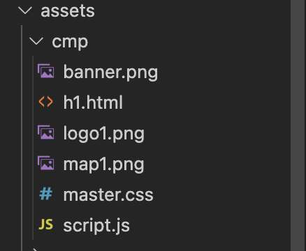

### 主要是依靠一个第三方插件

[webview_flutter_plus](https://pub.flutter-io.cn/packages/webview_flutter_plus)

测试时候的 flutter 信息：

```
Flutter 3.0.5 • channel stable • https://github.com/flutter/flutter.git
Framework • revision f1875d570e (3 周前) • 2022-07-13 11:24:16 -0700
Engine • revision e85ea0e79c
Tools • Dart 2.17.6 • DevTools 2.12.2
```


在 pubspec.yaml 中添加

```
webview_flutter_plus: ^0.3.0+2
```

#### 加载本地 html

新建文件 assets 把自己的网站资源放进去或者自己随便写个本地 html文件，目录如下：

 

在 pubspec.yaml 中加入资源：

```
	assets:
		- assets/cmp/script.js
    - assets/cmp/h1.html
    - assets/cmp/banner.png
    - assets/cmp/logo1.png
    - assets/cmp/map1.png
    - assets/cmp/master.css
```

其实是有插件的，就是把文件拖进项目，自动在 pubspec.yaml 中生成资源路径，还没研究。

这里有个简单的 Python 脚本，可以打印文件路径到命令窗口，然后复制到 pubspec.yaml 中就可以了，dir 换成要加载的网站资源路径

```python
import os
import shutil

dir = "/Users/xxx/Desktop/cmp"
a = 0
for root,dirs,files in os.walk(dir):
	for file in files:
		a = a + 1
		p = os.path.join(root,file)
		print(p.replace(dir,'    - assets/cmp'))

print("一共替换图片：%s" % (a))
```

#### 代码部分

pubspec.yam 搞完以后保存，然后就可以加载了，代码如下

引入头文件

```dart
import 'package:webview_flutter_plus/webview_flutter_plus.dart';
```

核心代代码

fliePath 和 _controller

```dart
  late WebViewPlusController _controller;
  String filePath = "assets/cmp/h1.html";
```


```dart
 return WebViewPlus(
   		initialUrl: filePath,
      onWebViewCreated: (controllerPlus) {
        print('on web created');
        this._controller = controllerPlus;
        controllerPlus.loadUrl(filePath);
      },
      javascriptMode: JavascriptMode.unrestricted,
    );
```

### Flutter 与 js 交互

创建以下测试 html 网页 命名 test.html

```html
<!DOCTYPE html>
<html lang="en">
<head>
    <meta charset="UTF-8">
    <meta name="viewport" content="width=device-width, initial-scale=1.0">
    <title>html demo</title>
</head>
<body>
<script>

// 这个方法是用来给Flutter调用的（即：Flutter调用js方法
        function showMessage (message){
            document.getElementById ("content").innerHTML = message;
            return true;
        }

// 这个方法是用来发送一个消息给Flutter的（即：js调用Flutter方法)
        function sendMessage (message ) {
            MessageDeal.postMessage(message);
            document.getElementById ("content2").innerHTML = message;
        }

</script>
<div id="content"><span>Flutter发送过来的消息是： </span>test</div>
<div id="content2"><span>我发送给Flutter的消息是：</span>test2</div>

<button onclick="sendMessage('我来自js调用sendMessage，我调用了Flutter中的功能')">send a message to Flutter</button>

</body>
</html>
```

记得在 pubspec.yaml 添加资源 并保存

```
	assets:
		- assets/html/test.html
```

这里的filePath 换成本地测试 html

```dart
late WebViewPlusController _controller;
String filePath = "assets/html/test.html";
```


```dart
return WebViewPlus(
      initialUrl: filePath,
      onWebViewCreated: (controllerPlus) {
        print('on web created');
        this._controller = controllerPlus;
        controllerPlus.loadUrl(filePath);
      },
      javascriptMode: JavascriptMode.unrestricted,
      onWebResourceError: ((error) {
        print('Error = $error');
      }),
      onPageFinished: (url) {
        print('on page finished $url');
      },
      onPageStarted: (url) {
        print('on page start $url');
      },
      onProgress: (progress) {
        print('progress $progress');
      },
  		//这里处理 js 发给 flutter 的信息
      javascriptChannels: {
        JavascriptChannel(
            name: 'MessageDeal',
            onMessageReceived: (message) {
              print(message.message);
            })
      },
    );
```

这个方法处理 flutter 给 js 发消息

```dart
 _sentMessageToJs() {
    _controller.webViewController
        .runJavascript('showMessage("From Flutter")');
  }
```

完整 dart 代码

```dart
import 'package:flutter/material.dart';
import 'package:webview_flutter_plus/webview_flutter_plus.dart';

class WebPage extends StatefulWidget {
  const WebPage({Key? key}) : super(key: key);

  @override
  State<WebPage> createState() => _WebPageState();
}

class _WebPageState extends State<WebPage> {
  late WebViewPlusController _controller;

  String filePath = "assets/cmp/test.html";

  int number = 0;

  @override
  Widget build(BuildContext context) {
    return Scaffold(
      appBar: AppBar(
        title: Text('WebView'),
      ),
      body: Center(
        child: _webView(),
      ),
      floatingActionButton: FloatingActionButton(
        onPressed: _sentMessageToJs,
        child: const Icon(Icons.add),
      ),
    );
  }

  _sentMessageToJs() {
    number += 1;
    _controller.webViewController
        .runJavascript('showMessage("From Flutter $number")');
  }

  _webView() {
    return WebViewPlus(
      initialUrl: filePath,
      onWebViewCreated: (controllerPlus) {
        print('on web created');
        this._controller = controllerPlus;
        controllerPlus.loadUrl(filePath);
      },
      javascriptMode: JavascriptMode.unrestricted,
      onWebResourceError: ((error) {
        print('Error = $error');
      }),
      onPageFinished: (url) {
        print('on page finished $url');
      },
      onPageStarted: (url) {
        print('on page start $url');
      },
      onProgress: (progress) {
        print('progress $progress');
      },
      //这里处理 js 发给 flutter 的信息
      javascriptChannels: {
        JavascriptChannel(
            name: 'MessageDeal',
            onMessageReceived: (message) {
              print(message.message);
            })
      },
    );
  }
}
```

这里我只是用的 iOS 模拟器测试的，Android 没试。
