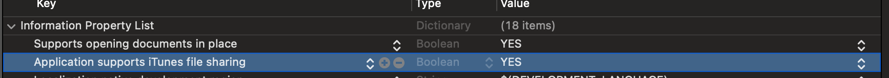

## 访问的路径就是 你的应用下的沙河目录 Documents

只是开启了权限，就会共享到系统 Files 下；在项目中的 Info.plist 中添加以下两项内容，并设置为 YES



Source Code

```objective-c
<key>LSSupportsOpeningDocumentsInPlace</key>
<true/>
<key>UIFileSharingEnabled</key>
<true/>
```

添加完以后跑一下项目。

Documents 文件夹下如果没有文件，那么在系统 Files 中是不显示你的 app 名称的文件夹的。 需要先在 Documents 下创建一个文件夹或者，打开手机的 照片-》 选中一张照片 -》点击分享 -》下拉到 存储到“文件” -》 我的iPhone 展开，就可以看到你的 app 命名的文件夹了。

在 Files 里面的文件夹，会将沙盒内 Documents 文件夹内的所有文件都显示出来，因此苹果建议在此文件夹中只存放用户创建的文件，如果将 App 创建的文件也放到这个目录下的话，会使这个文件夹看起来很杂乱。

如何打开了以上两个权限，肯定不建议把敏感的信息保存到沙盒内 Documents 文件夹内。

对文件的增删改查操作自己写，我只是想读取数据，一些代码。

```objective-c
//文件路径
-(NSString *)filesPath{
    return NSSearchPathForDirectoriesInDomains(NSDocumentDirectory, NSUserDomainMask, YES)[0];
}

//从文件中读取内容
-(void)getFiles{
    NSString *path = [self filesPath];
    
    NSFileManager *manager = [NSFileManager defaultManager];
    NSArray *files =  [manager subpathsAtPath:path];
    NSLog(@"%@", files);
}
```


[参考链接](https://blog.csdn.net/u014600626/article/details/104451237)

